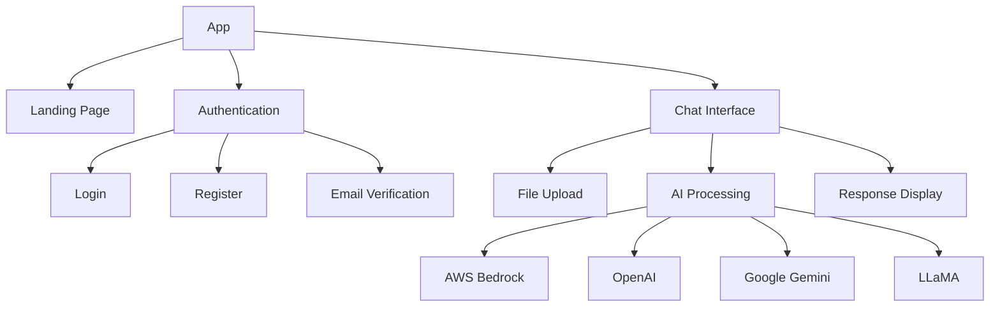

# Betasys.ai PO Assistant - Technical Documentation

## Overview

Betasys.ai PO Assistant is a web-based application designed to automate and streamline the processing of purchase orders using AI technology. The application allows users to upload PDF purchase orders, extract data, and generate structured formats like CSV.

### Key Features
- PDF purchase order processing
- AI-powered data extraction
- User authentication with email verification
- Dark/light theme support
- Multi-model AI support (Claude, GPT-4, GPT-3.5, Gemini Pro, LLaMA)

### Technology Stack
- **Frontend**: React 18, TypeScript, Vite
- **Styling**: Tailwind CSS
- **State Management**: Zustand
- **Routing**: React Router v6
- **PDF Processing**: react-pdf, pdfjs-dist
- **AI Integration**: AWS Bedrock, OpenAI, Google Gemini
- **Email Service**: Resend
- **Icons**: Lucide React
- **Deployment**: Netlify

## System Architecture

### Component Architecture


### Data Flow
1. User uploads PDF file
2. PDF is processed locally for text extraction
3. Extracted text is sent to AI service
4. AI response is processed and displayed
5. User can interact with the response

## Code Structure

```
src/
├── components/         # Reusable UI components
│   ├── admin/         # Admin interface components
│   ├── chat/          # Chat interface components
│   └── layout/        # Layout components
├── lib/               # Utility functions and services
│   └── ai-providers/  # AI service integrations
├── pages/             # Page components
├── store/             # State management
└── types/             # TypeScript type definitions
```

### Key Components

#### Chat Interface
The main chat interface (`src/pages/chat.tsx`) handles:
- File upload and processing
- Message display and interaction
- AI model selection
- Theme switching

```typescript
// Example: Message handling in chat.tsx
const handleSendMessage = async (mediaContent: MediaContent[]) => {
  addMessage(mediaContent, 'user');
  setLoading(true);

  try {
    const response = await getBedrockResponse(prompt);
    addMessage([{ type: 'text', content: response.content }], 'assistant');
  } catch (error) {
    // Error handling
  } finally {
    setLoading(false);
  }
};
```

## Setup and Deployment

### Local Development Setup
1. Clone the repository
2. Install dependencies:
   ```bash
   npm install
   ```
3. Create `.env` file with required environment variables:
   ```env
   VITE_RESEND_API_KEY=your_resend_api_key
   VITE_AWS_ACCESS_KEY_ID=your_aws_access_key
   VITE_AWS_SECRET_ACCESS_KEY=your_aws_secret_key
   VITE_AWS_REGION=your_aws_region
   VITE_S3_BUCKET_NAME=your_bucket_name
   ```
4. Start development server:
   ```bash
   npm run dev
   ```

### Production Deployment
The application is configured for deployment on Netlify:

1. Connect repository to Netlify
2. Configure environment variables in Netlify dashboard
3. Deploy using:
   ```bash
   npm run build
   ```

## Authentication System

### User Registration Flow
1. User submits registration form
2. Verification code is generated and sent via email
3. User verifies email with code
4. Account is activated upon successful verification

```typescript
// Example: Registration handling
const register = async (name: string, email: string, password: string) => {
  const verificationCode = generateVerificationCode();
  await sendVerificationEmail(email, verificationCode, name);
  // Store pending verification
};
```

## Error Handling

### Common Error Scenarios
1. Invalid AWS credentials
2. PDF processing failures
3. Email verification issues
4. AI service timeouts

Example error handling:
```typescript
try {
  const response = await getBedrockResponse(prompt);
} catch (error) {
  if (error.name === 'UnrecognizedClientException') {
    // Handle AWS authentication error
  } else if (error.name === 'ServiceUnavailable') {
    // Handle service availability issues
  }
}
```

## Security Measures

### Authentication
- Email verification required for new accounts
- Session management using Zustand persist middleware
- Protected routes using React Router

### API Security
- Environment variables for sensitive credentials
- AWS IAM roles and permissions
- Rate limiting on email verification attempts

## Performance Optimization

### PDF Processing
- Client-side PDF text extraction
- Efficient state management with Zustand
- Lazy loading of PDF viewer component

### UI Optimization
- Tailwind CSS for efficient styling
- Responsive design patterns
- Debounced input handlers

## Maintenance Guidelines

### Regular Maintenance Tasks
1. Update dependencies monthly
2. Monitor AWS usage and costs
3. Review and rotate API keys
4. Check error logs in Netlify dashboard

### Version Updates
1. Test updates in development environment
2. Update dependencies gradually
3. Follow semantic versioning
4. Maintain changelog

## Extending the Application

### Adding New AI Models
1. Create new provider in `src/lib/ai-providers/`
2. Add provider configuration to `config-store.ts`
3. Update model selector component
4. Add provider-specific error handling

### Custom PDF Processing
1. Extend PDF viewer component
2. Add custom text extraction logic
3. Implement new data processing features

## Testing

### Unit Tests
- Test AI provider integrations
- Test authentication flows
- Test PDF processing functions

### Integration Tests
- Test end-to-end user flows
- Test API integrations
- Test file upload and processing

## Appendix

### Environment Variables
```env
VITE_RESEND_API_KEY        # Resend API key for email service
VITE_AWS_ACCESS_KEY_ID     # AWS access key for Bedrock
VITE_AWS_SECRET_ACCESS_KEY # AWS secret key
VITE_AWS_REGION           # AWS region (e.g., us-east-1)
VITE_S3_BUCKET_NAME       # S3 bucket for file storage
```

### Useful Commands
```bash
npm run dev      # Start development server
npm run build    # Build for production
npm run preview  # Preview production build
npm run test     # Run tests
```

### Resources
- [React Documentation](https://react.dev)
- [Tailwind CSS](https://tailwindcss.com)
- [AWS Bedrock](https://aws.amazon.com/bedrock)
- [Resend Documentation](https://resend.com/docs)